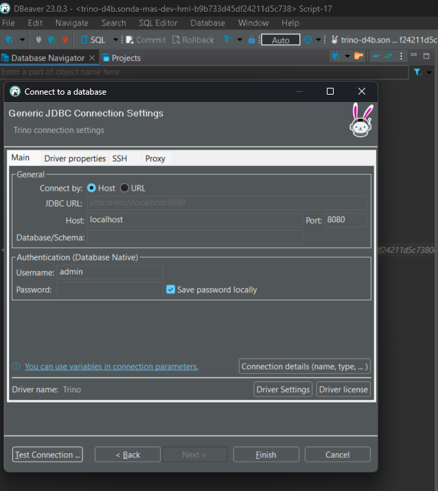
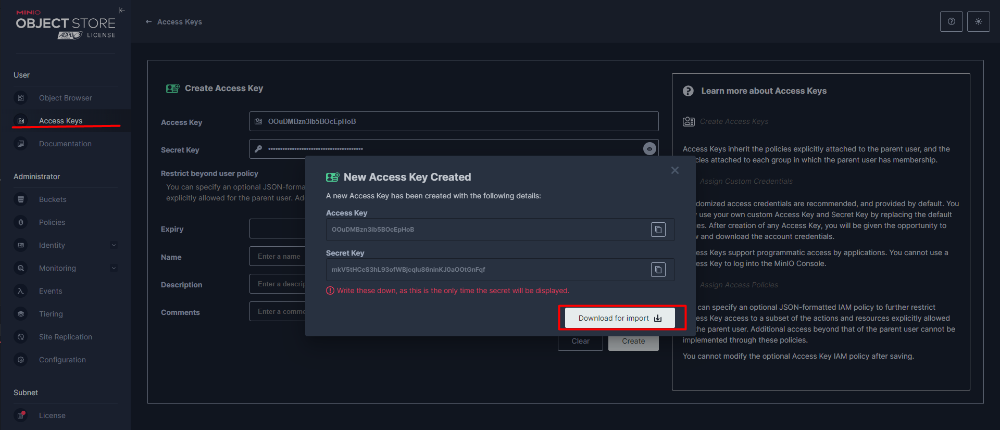
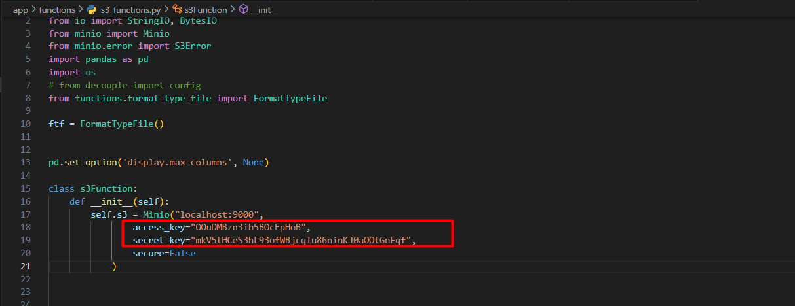
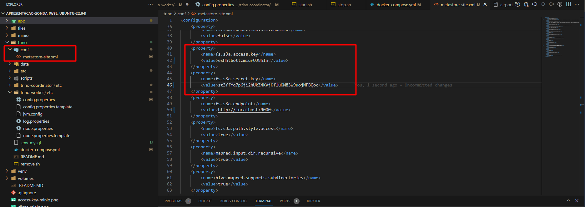
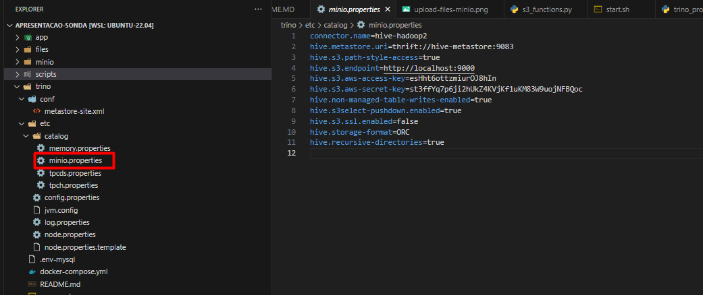

# Inciando os serviços

## De permissao de execuçao aos arquivos .sh
chmod +x start.sh
chmod +x stop.sh


## Execute o arquivo start.sh para iniciar os serviços
```bash
./start.sh
```


## Verifique o acesso
## Os usuários e senhas se encontram dentro dos arquivos envs
localhost:9001 e localhost:8080 

## Para executar os arquivos python, vamos criar um ambiente virutal
## Necessário ter o python3 e pip instalado na máquina

```bash
# Instalando o pacote para ambiente virutal
pip install virtualenv
# Criando um ambiente virtual
python -m venv ./venv 
```

## Ativando o ambiente virutal
### Habilitando o terminal para executar comandos dentro do ambiente virtual
```bash
source venv/bin/activate
```

## Desativando o ambiente virual
```bash
source deactivate
```

## Conexão jdb com o trino utilizando dbeaver 



# Configurando MinIO e Trino


## Navegue para User - < Access Keys  e crie uma nova chave e faça o download da chave


## Altere da access_key e secret_key do arquivo s3_functions.py com os valores do json



## Altere também a configuraçao do trino nos arquivos:
conf/metastore-site.xml
etc/minio.properties





# Executando os comandos

Abra o arquivo app -> app.ipynb  e selecione a venv criada


### OBS: os ips precisam ser da rede docker
```bash
ipconfig
```
usar ip docker0
